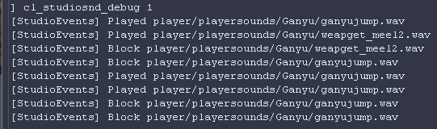

# StudioEvents 文档

[English](../en/features.md) · [构建与安装](../../README.zh-CN.md)

## 功能

StudioEvents 过滤带有音效名称的 Studio 声音事件（事件 5004），可丢弃或延迟重复音效，也可屏蔽玩家音效。其他 Studio 事件会转发给原始客户端回调。



## 兼容性

| 引擎 | 原插件支持 |
| --- | --- |
| GoldSrc_blob (< 4554) | 支持 |
| GoldSrc_legacy (< 6153) | 支持 |
| GoldSrc_new (8684 ~) | 支持 |
| SvEngine (8832 ~) | 支持 |
| GoldSrc_HL25 (>= 9884) | 支持 |

此表继承自原插件。运行时还需要 MetaHook API 109 或更新版本，以及包含 `engine/r_model` 的匹配 gamedata 快照，不代表此独立构建已逐一完成游戏内验证。

## 控制台参数

| CVar | 默认值 | 行为 |
| --- | --- | --- |
| `cl_studiosnd_anti_spam_diff` | `0.5` | 与上次音效的实体、动画帧或音效名称不同时，播放所需的最小间隔，单位为秒。 |
| `cl_studiosnd_anti_spam_same` | `1.0` | 实体、动画帧和音效名称均相同时，播放所需的最小间隔，单位为秒；名称区分大小写。 |
| `cl_studiosnd_anti_spam_delay` | `0` | 非零时将被过滤的音效延迟播放，否则直接丢弃。 |
| `cl_studiosnd_block_player` | `0` | 大于零时屏蔽玩家声音事件；viewmodel 不属于玩家实体。 |
| `cl_studiosnd_debug` | `0` | 非零时在游戏控制台输出声音事件的处理结果。 |

间隔检查使用共享播放历史，包含不同实体的事件。延迟音效到期后由 `HUD_Frame` 重试，仅在实体通过原有消息编号检查时播放。`HUD_VidInit` 会清空播放历史和延迟队列。

## 白名单

- `studioevents/sound_whitelist.txt`：匹配音效文件名。
- `studioevents/sourcemodel_whitelist.txt`：匹配引擎当前渲染的音效来源模型。

两份列表在客户端初始化（`HUD_Init`）时读取。每行填写一个完整路径，包含空格的路径使用引号。匹配区分大小写，必须完整匹配。任一列表匹配成功后，都会绕过 anti-spam 检查和玩家音效屏蔽。

压缩包保留原插件的默认列表。例如，声音白名单包含：

```text
weapons/357_chamberout.wav
```
