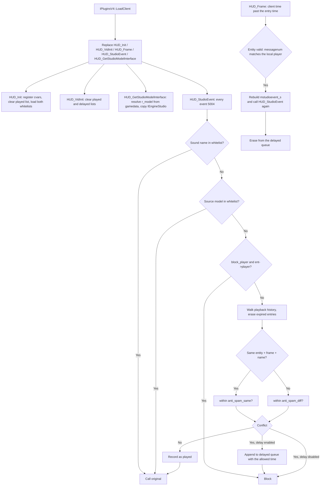

# StudioEvents

StudioEvents is a MetaHook plugin that controls and filters Studio model event sounds (event 5004).
It implements an anti-spam mechanism that prevents repeated or overlapping sound-event playback,
supports delayed playback instead of discarding, can block player sound events, and lets sound files
and source models bypass the filtering through whitelists.

## Provenance

This repository is the standalone StudioEvents plugin, extracted from MetaHookSv
(`Plugins/StudioEvents/`) into its own CMake workspace, aligned with the standalone Renderer,
PrecacheManager and HeapPatch projects. This note was migrated from MetaHookSv
`memory/StudioEvents.md` and adapted to the new layout: plugin sources moved to `src/`, the MSBuild
project was replaced by CMake plus a self-owned gamedata catalog, and the user documentation now
lives in `docs/en/features.md` and `docs/zh-CN/features.md`. The migrated note did not describe the
whitelists, so they were documented here from the current sources
(`sound_whitelist.txt` / `sourcemodel_whitelist.txt` and `EngineStudio_GetCurrentRenderModelName`).
The `metahooksv` Basic Memory project belongs to the source repository; notes here use the
`studioevents` project and the `studioevents/` permalink prefix.

## Responsibilities and entry points

- `src/plugins.cpp`: `IPluginsV4` lifecycle. `LoadEngine` collects the file system, engine
  type/buildnum, the engine image sections (including the mirror image when the host provides one)
  and copies `cl_enginefunc_t`; `LoadClient` replaces `HUD_Init`, `HUD_VidInit`, `HUD_Frame`,
  `HUD_StudioEvent` and `HUD_GetStudioModelInterface`; `ExitGame` and `Shutdown` are empty. Exported
  through `EXPOSE_SINGLE_INTERFACE(IPluginsV4, IPluginsV4, METAHOOK_PLUGIN_API_VERSION_V4)`.
- `src/exportfuncs.cpp`: all of the behavior — cvar registration, whitelist loading, the filtering
  decision in `HUD_StudioEvent`, and the delayed queue processed in `HUD_Frame`.
- `src/privatehook.cpp`: `EngineStudio_FillAddress` resolves the single engine global `r_model`; the
  hook/address entry points (`Engine_FillAddress`, `Engine_InstallHooks`, `EngineStudio_InstalHooks`)
  are currently empty.
- `src/plugins.h`: engine/plugin globals, the `GamedataResolvePtr` helper (resolves one gamedata
  symbol and aborts with a diagnostic on failure) and the retained signature-scan macros.
- `src/MurmurHash2.cpp`, `src/MurmurHash2.h`: Austin Appleby's public-domain hash used for whitelist
  membership.
- `src/privatehook.h`, `src/exportfuncs.h`: engine global declaration and the replaced exports.

Console variables:

| CVar | Default | Flags | Meaning |
| --- | --- | --- | --- |
| `cl_studiosnd_anti_spam_diff` | `0.5` | `FCVAR_CLIENTDLL \| FCVAR_ARCHIVE` | Minimum interval (s) after an event with a different entity, frame or sound name. |
| `cl_studiosnd_anti_spam_same` | `1.0` | `FCVAR_CLIENTDLL \| FCVAR_ARCHIVE` | Minimum interval (s) for the same entity, frame and sound name. |
| `cl_studiosnd_anti_spam_delay` | `0` | `FCVAR_CLIENTDLL \| FCVAR_ARCHIVE` | Nonzero delays filtered sounds instead of discarding them. |
| `cl_studiosnd_block_player` | `0` | `FCVAR_CLIENTDLL \| FCVAR_ARCHIVE` | Greater than zero blocks player sound events. |
| `cl_studiosnd_debug` | `0` | `FCVAR_CLIENTDLL` | Nonzero prints every decision to the console. |

## Architecture

Decision details:

- Only events with `ev->event == 5004` and a non-empty `ev->options` are filtered; every other event
  is forwarded to `gExportfuncs.HUD_StudioEvent` untouched.
- Whitelists are checked before everything else and bypass both the anti-spam filtering and the
  player blocking.
- The history walk computes `max_duration = max(anti_spam_diff, anti_spam_same)` and erases entries
  older than `time + max_duration`. A "same sound" entry is one with the same `entindex`, the same
  `frame` and a `strcmp`-equal, case-sensitive name; such an entry is compared against
  `anti_spam_same`, every other entry against `anti_spam_diff`.
- On a conflict the plugin records the latest allowed time (`entry.time + interval`, keeping the
  maximum) and either appends the sound to the delayed queue or drops it, returning without calling
  the original. Without a conflict it records the sound in the played list and falls through to the
  original call.
- A delayed entry is replayed from `HUD_Frame` by constructing an `mstudioevent_s`
  (`event = 5004`, the stored `frame`, `options` = the stored name, `type = 0`) and calling
  `HUD_StudioEvent` with it, so the replayed sound goes through the filter again. The entry is erased
  from the queue whether or not the replay happens.
- `HUD_Frame` returns early when there is no local player, so the delayed queue is only serviced
  while a local player exists.

## Dependencies

- **MetaHook API** (>= 109, enforced by a `static_assert` in `src/plugins.h`): `ResolveGameSymbol`
  through the `GamedataResolvePtr` helper, `GetGameSymbolStatusString`, `GetEngineType`,
  `GetEngineBuildnum`, `GetEngineBase` / `GetEngineSize` / `GetMirrorEngineBase` /
  `GetMirrorEngineSize` / `GetSectionByName`, and `SysError`.
- **Engine exports / interfaces**: `cl_enginefunc_t` (`pfnRegisterVariable`, `GetClientTime`,
  `GetLocalPlayer`, `GetEntityByIndex`, `Con_Printf` / `Con_DPrintf`), `cl_exportfuncs_t`
  (`HUD_Init`, `HUD_VidInit`, `HUD_Frame`, `HUD_StudioEvent`, `HUD_GetStudioModelInterface`),
  `engine_studio_api_t`, and the engine global `r_model` (`model_t**`, the currently rendered model).
- **File system**: the engine file macro layer (`FILESYSTEM_ANY_OPEN` / `READLINE` /
  `PARSEFILE` / `EOF` / `CLOSE`) reads the whitelists through the client file system.
- **Build-only inputs**: MetaHook source tree (read-only) and VC-LTL 5.3.1; Capstone headers are used
  indirectly through the MetaHook API and Capstone is not linked. No third-party library is linked.
- **Runtime data**: `svencoop/studioevents/sound_whitelist.txt` and
  `svencoop/studioevents/sourcemodel_whitelist.txt` (shipped with the plugin), plus the
  `metahook/gamedata/studioevents` catalog for `r_model`.

## Repository layout

- `src/plugins.cpp`, `src/plugins.h` — plugin lifecycle, engine image info, gamedata helper.
- `src/exportfuncs.cpp`, `src/exportfuncs.h` — filtering, whitelists, delayed queue, exports.
- `src/privatehook.cpp`, `src/privatehook.h` — `r_model` resolution and the retained (currently empty)
  hook entry points.
- `src/MurmurHash2.cpp`, `src/MurmurHash2.h` — whitelist hashing.
- `assets/svencoop/studioevents/` — the default sound and source-model whitelists.
- `docs/en/features.md`, `docs/zh-CN/features.md`, `docs/img/8.png` — features, cvar table,
  compatibility table and a console screenshot.
- `CMakeLists.txt`, `cmake/Sources.cmake` (explicit compile list), `cmake/Dependencies.cmake`,
  `cmake/VCLTL.cmake` — build.
- `scripts/build-StudioEvents-x86-{Debug,Release}.bat` — configure/build/install entry points.
- `scripts/manifests/studioevents.json`, `scripts/sync-gamedata.py`, `scripts/validate-gamedata.py` —
  gamedata synchronization and validation.
- `README.md`, `README.zh-CN.md` — install and build documentation. There is no test suite.

## Build and data flow

`scripts/build-StudioEvents-x86-{Debug,Release}.bat` → CMake (Visual Studio 17 2022, `-A Win32`) →
compile the DLL → install. The build uses MSVC x86 / C++20, a static CRT and VC-LTL 5.3.1, with the
explicit compile list in `cmake/Sources.cmake` (4 plugin units plus the SDK's `interface.cpp`).
`scripts/manifests/studioevents.json` → `scripts/sync-gamedata.py` → pruned catalog under
`build/x86/<Configuration>/assets/svencoop/metahook/gamedata/studioevents`, validated before the
plugin target builds; disable with `-DSTUDIOEVENTS_SYNC_GAMEDATA=OFF` and override the path with
`STUDIOEVENTS_GAMEDATA_DIR`.
The manifest declares the single `engine` / `r_model` global for 11 engine snapshots (`cof-5936`,
`hl-10210`, `hl-3248`, `hl-3266`, `hl-3329`, `hl-3647`, `hl-4554`, `hl-6153`, `hl-8684`,
`svencoop-10257`, `svencoop-8948`); catalog coverage is not a validation statement.
Install output is `install/x86/<Configuration>/svencoop/` containing
`metahook/plugins/StudioEvents.dll` (+ PDB), `metahook/gamedata/studioevents/` and the
`studioevents/` whitelists; nothing is deployed into the game automatically.

## Notes

- `r_model` is resolved from gamedata in `EngineStudio_FillAddress`, which runs from
  `HUD_GetStudioModelInterface`, not from `LoadEngine`. A resolution failure is fatal through
  `GamedataResolvePtr` (`Could not resolve gamedata symbol: r_model ...` with the status string and
  engine buildnum); the plugin has no signature-scan fallback. Unlike the other standalone plugins,
  this diagnostic does not include the module CRC64.
- `EngineStudio_GetCurrentRenderModelName` returns an empty string when `r_model` or `*r_model` is
  null, so the source-model whitelist simply cannot match in that state.
- Whitelist matching stores `MurmurHash2(name, strlen(name), 0)` in a `std::unordered_set<uint32_t>`
  and matches on the hash alone. Matching is therefore exact and case-sensitive for the full string,
  but a 32-bit hash collision would whitelist an unrelated name; the same hash function is used for
  both lists.
- Whitelist files are read from `studioevents/sound_whitelist.txt` and
  `studioevents/sourcemodel_whitelist.txt` at `HUD_Init` only, through
  `FILESYSTEM_ANY_OPEN(..., "rt")`; one path per line, optional quotes via
  `FILESYSTEM_ANY_PARSEFILE`, first token only. A missing file is only reported through
  `Con_DPrintf`, and the corresponding set stays empty. Both sets are cleared before loading, so
  re-entering `HUD_Init` reloads them.
- The sound name is copied with `strcpy` into a fixed `char name[64]` buffer in
  `studio_event_sound_t`, and the delayed replay does the same into `mstudioevent_s::options`; that is
  longer than typical engine sound paths but is not length-checked (the migrated note lists this as a
  known hardening item).
- The entity-validity check for replayed sounds compares `ent->curstate.messagenum` with the local
  player's. The code carries a `TODO` noting that `cl_parsecount` may be the correct counter, because
  a player that was not emitted can keep a stale `messagenum`; the delayed entry is erased either way.
- `HUD_VidInit` clears both lists, which is what resets the state across map changes and
  reconnections; `HUD_Init` clears only the played list.
- The plugin keeps MetaHookSv scaffolding that is not wired up: `Engine_FillAddress`,
  `Engine_InstallHooks` and `EngineStudio_InstalHooks` are empty, `ExitGame`/`Shutdown` do nothing,
  `ConvertDllInfoSpace` / `GetVFunctionFromVFTable` and the mirror/`g_ClientDLLInfo` image info are
  unused, and `private_funcs_t` is a placeholder. The signature-scan macros in `src/plugins.h` are
  retained but no scan path remains.

## Callers (optional)

- The host MetaHook loader drives `Init` / `LoadEngine` / `LoadClient` / `ExitGame` / `Shutdown` and
  loads `metahook/plugins/StudioEvents.dll` from `plugins.lst`.
- The client export chain calls the replaced `HUD_Init`, `HUD_VidInit`, `HUD_Frame`,
  `HUD_StudioEvent` and `HUD_GetStudioModelInterface`; the engine's Studio renderer dispatches every
  model event to `HUD_StudioEvent`.
- `HUD_Frame` re-enters the plugin's own `HUD_StudioEvent` for due delayed sounds, and the original
  callback is reached through `gExportfuncs` in every non-blocked path.
- The host launcher merges `metahook/gamedata/studioevents` into its gamedata catalog.

## External documentation

`README.md` is the English landing page and `README.zh-CN.md` the Chinese one; the feature pages
`docs/en/features.md` and `docs/zh-CN/features.md` document the cvar table, the whitelists and the
inherited engine compatibility table.
